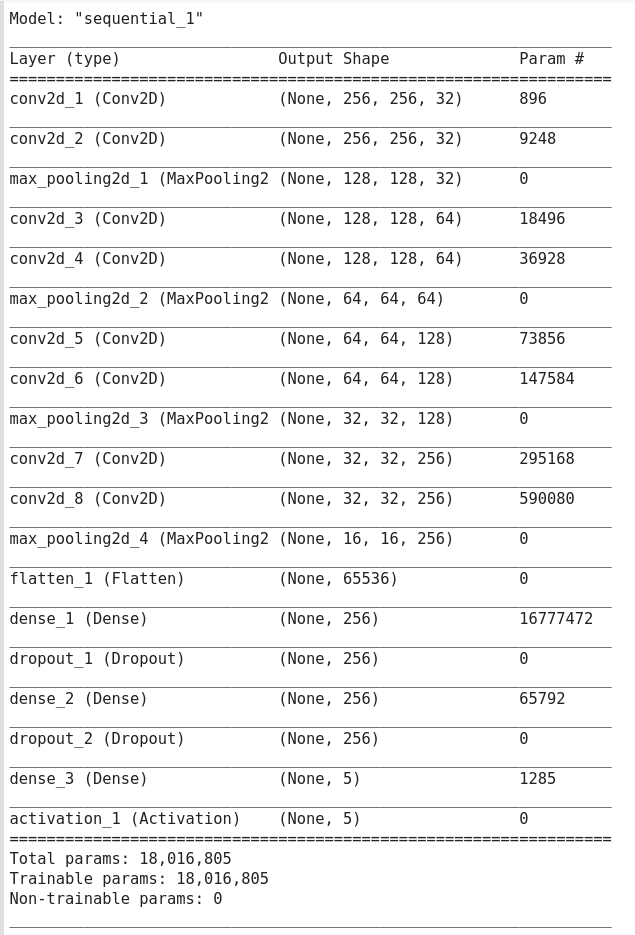
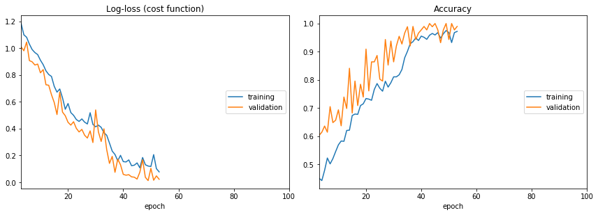
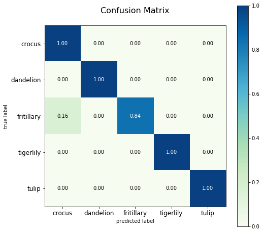
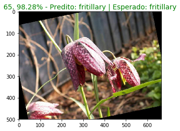
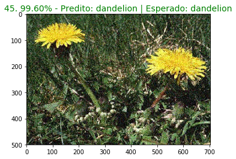
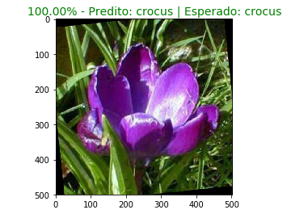

# image_classifier

Este projeto apresenta um notebook com os passos necessários para treinar um modelo de classificação de imagens. 

O projeto está organizado do seguinte modo:

* diretório **dataset:** possui um conjunto de imagens de flores divididas em 5 categorias, o número total de imagens está divido na proporção:
* **train:** 80%
* **test:** 10%
* **val:** 10%
   
*O dataset original está disponível no endereço [http://www.robots.ox.ac.uk/~vgg/data/flowers/17/](http://www.robots.ox.ac.uk/~vgg/data/flowers/17/)*

* diretório **utils:** possui quatro scripts para auxiliar no pré-processamento e na orgazinação das imagens de treino: 
    * copy_random_files.py
    * increased_data.py
    * rename_file.py
    * split_dataset.py

* As instruções de uso de cada script encontram-se no início do próprio script

* Pipifile
* image_classifier.ipynb

### Treinando um modelo para classificar flores

Para testar a estrutura da rede, treinei um modelo para classificar 5 categorias de flores. A divisão do dataset para realização do treino é apresentada a seguir:

* dataset
    * train (192 exemplos de cada)
        * crocus 
        * dandelion
        * fritillary
        * tigerlily
        * tulip
    * test (25 exemplos de cada)
        * crocus
        * dandelion
        * fritillary
        * tigerlily
        * tulip
    * val (24 exemplos de cada)
        * crocus
        * dandelion
        * fritillary
        * tigerlily
        * tulip

### Informações do treino:

#### Input

* **Dataset:**  [17 Category Flowers Dataset](http://www.robots.ox.ac.uk/~vgg/data/flowers/17/)
* **Finalidade:** Classificar imagens de flores em 5 categorias distintas

#### Estrutura da rede



### Treino



### Output

* Acurácia do modelo: **0.968**
* Matriz de Confusão:




### Classificando algumas imagens:
||||

### Convertendo o modelo Keras para Tensorflow

Para converter o modelo do formato *.h5* do Keras para um modelo Tensorflow e disponibilizá-lo no Tf Serving você pode executar o seguinte código:

``` 
tf.keras.backend.set_learning_phase(0)  # Ignore dropout at inference

export_path = path_to_save_model_tensorflow


with tf.keras.backend.get_session() as sess:
    sess.run(tf.global_variables_initializer())
    model = load_model(path_to_save_model_keras)
    tf.saved_model.simple_save(
        sess,
        export_path,
        inputs={'input_image': model.input},
        outputs={t.name: t for t in model.outputs})

```

**OBS:** O código para conversão do modelo está disponível também na última célula do notebook.

### Servindo o modelo no tf serving

Para servir o modelo utilizando o [TF Serving](https://www.tensorflow.org/tfx/guide/serving) gerado basta subir um container docker e utilizando o seguinte comando:

```
docker pull tensorflow/serving && \

docker run -p 8501:8501 -d -v absolut_path_to_model:/models/flowers_classifier -e MODEL_NAME=document_classifier -t tensorflow/serving

 ```

 *A linha de comando irá baixar uma imagem do tensorflow serving e em seguida creará um container docker, que poderá ser acessado pela endreço http://127.0.0.1:8501/v1/models/flowers_classifier:predict*

 *flowers_classifier: refere-se ao nome informado no momento em que o container foi criado.*

--------------------------
| [**Portifólio**](https://marcos-marques.github.io/) | [**Blog**](https://medium.com/@marcosrlmarques) | [**GitHub**](https://github.com/marcos-marques?tab=repositories) |


